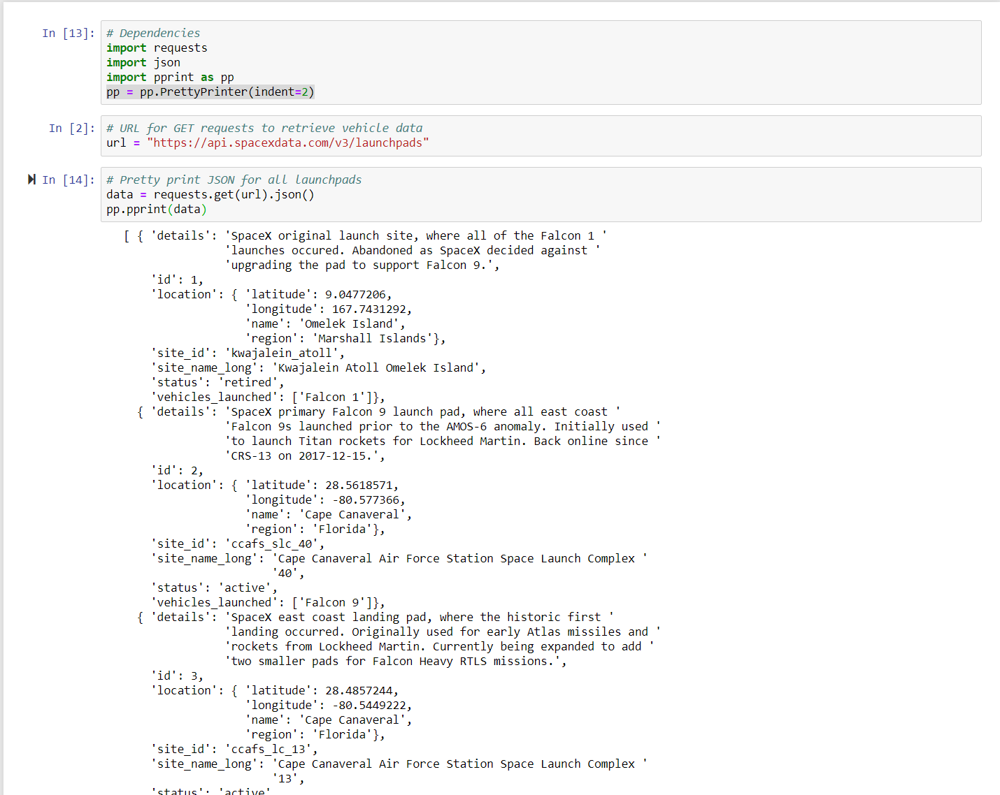
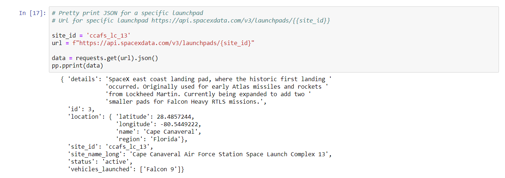

# SpaceX API
# Intro to APIs

###Explore SpaceX API documentation
[https://github.com/r-spacex/SpaceX-API/wiki]

*Use requests library to send requests
*Retrieve and print data for all launchpads

*Retrieve and print data for one launchpads

